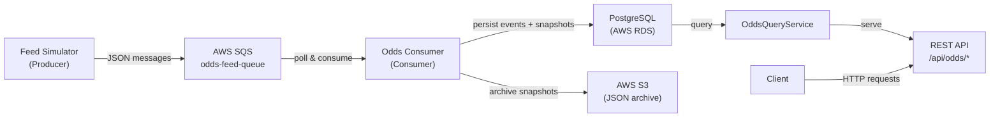

# OddsPulse


> **Real-time sports odds feed microservice — producer/consumer architecture deployed on AWS, inspired by high-volume betting platform design.**

---

## Architecture



---

## Why This Project

In live betting platforms like Betfair, odds change thousands of times per second across hundreds of concurrent events. The ingestion pipeline **must be decoupled** from the API serving layer — if the REST API slows down, it should never cause the feed to drop messages.

OddsPulse demonstrates this with a **producer/consumer pattern** using AWS SQS as the message broker. The `FeedSimulator` publishes odds updates to a queue, while the `OddsConsumer` polls independently, persists to PostgreSQL, and archives every snapshot to S3. This means:

- **Resilience** — API downtime doesn't lose feed data; messages stay in SQS
- **Scalability** — Multiple consumers can drain the queue in parallel
- **Auditability** — S3 provides an append-only archive for historical odds analysis and regulatory compliance

---

## Tech Stack

| Layer | Technology |
|---|---|
| **API** | Spring Boot 3, Java 21 |
| **Messaging** | AWS SQS (producer/consumer pattern) |
| **Storage** | PostgreSQL 16 on AWS RDS |
| **Archive** | AWS S3 (JSON snapshots) |
| **Container** | Docker, AWS ECR |
| **Hosting** | AWS EC2 |
| **Local Dev** | LocalStack (SQS + S3 emulation) |
| **Orchestration** | Kubernetes (bonus) |

---

## API Endpoints

| Method | Path | Description |
|---|---|---|
| `GET` | `/api/odds/events` | List events, optional filters: `sportType`, `status` (default `UPCOMING`) |
| `GET` | `/api/odds/events/{eventId}` | Get single event with latest odds snapshot |
| `GET` | `/api/odds/events/{eventId}/history` | Full odds history for an event (newest first) |
| `GET` | `/api/odds/events/{eventId}/latest` | Most recent odds snapshot for an event |
| `GET` | `/api/odds/live` | All events with status `LIVE` across all sports |

---

## Local Development

### Prerequisites

- Docker & Docker Compose

### Quick Start

```bash
git clone https://github.com/ChiraCosminFlorian/Oddspulse.git
cd Oddspulse
docker-compose up --build
```

| Service | URL |
|---|---|
| App | http://localhost:8080 |
| Actuator Health | http://localhost:8080/actuator/health |
| LocalStack SQS/S3 | http://localhost:4566 |
| PostgreSQL | `localhost:5432` (user: `odds_user`, db: `oddspulse`) |

---

## Example Requests

```bash
# List all upcoming events
curl http://localhost:8080/api/odds/events

# Filter by sport and status
curl "http://localhost:8080/api/odds/events?sportType=FOOTBALL&status=LIVE"

# Get a specific event with latest odds
curl http://localhost:8080/api/odds/events/EVT001

# Get full odds history for an event
curl http://localhost:8080/api/odds/events/EVT001/history

# Get the latest snapshot only
curl http://localhost:8080/api/odds/events/EVT001/latest

# Get all live events across all sports
curl http://localhost:8080/api/odds/live
```

---

## What I Learned

- **AWS SQS producer/consumer pattern** — Reliable message delivery with automatic retries and dead-letter queue support
- **Decoupling ingestion from serving** — Message queues let the feed and API scale independently
- **S3 as an append-only archive** — Cost-effective storage for time-series odds data, enabling historical analysis
- **LocalStack for local AWS emulation** — Develop against SQS and S3 without an AWS account or incurring costs
- **Kubernetes health probes & secret management** — Liveness/readiness probes for zero-downtime deployments, Secrets for secure credential injection
